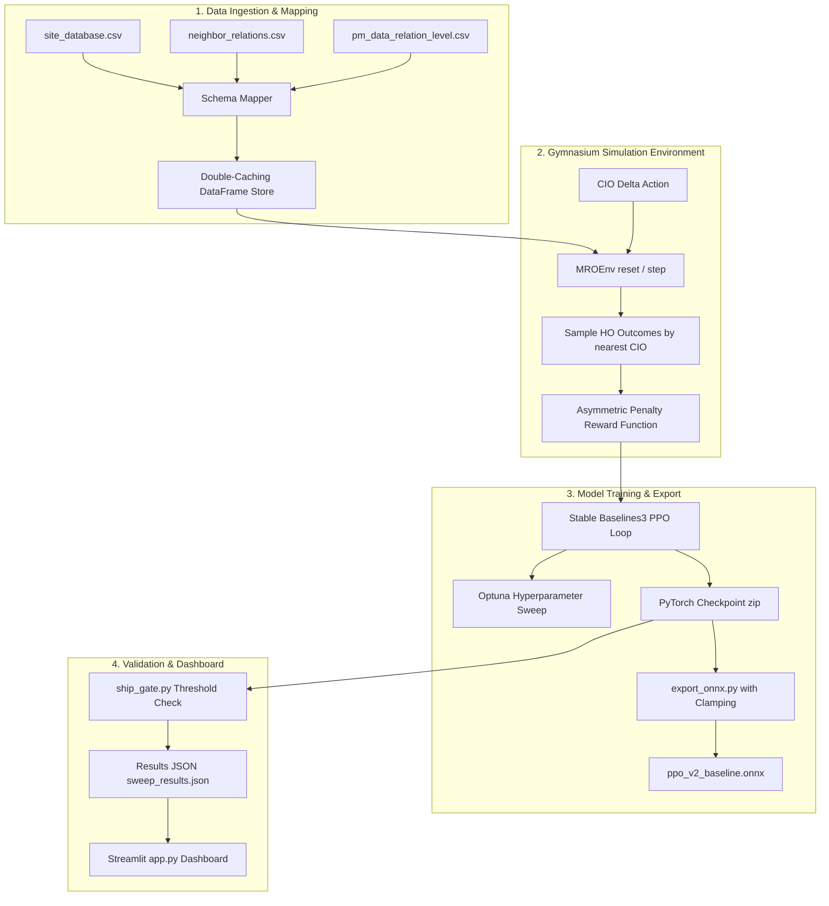

# System Architecture Overview
## LTE Handover Optimization (MRO) RL Training Pipeline

This document details the software architecture, data flows, and component layouts of the AltioStar Mobility Robustness Optimization (MRO) Reinforcement Learning pipeline.

---

## 1. System Context & Flow

The pipeline ingests mobile operator performance data (PM files), validates schemas, feeds them into a custom Gymnasium simulation environment, optimizes cell-individual offsets (CIOs) via PPO, and outputs trained models alongside visual KPI dashboards.

---

## 2. Key Components

### A. Data Layer (`src/pipeline/`)
* **[models.py](file:///Users/shouryasolanki/Developer/altiostar-tokyo-mro/src/pipeline/models.py)**: Strong Pydantic data schemas defining the contract for site configurations, relations, and PM counters.
* **[schema_mapper.py](file:///Users/shouryasolanki/Developer/altiostar-tokyo-mro/src/pipeline/schema_mapper.py)**: Geography-agnostic signature mapper. Detects column types and matches schemas using sets to remain robust against column order changes.
* **[loader.py](file:///Users/shouryasolanki/Developer/altiostar-tokyo-mro/src/pipeline/loader.py)**: Manages CSV-to-parquet conversions and handles data chunking for 2M+ record sets.

### B. Gymnasium Environment Layer (`src/env/`)
* **[mro_env.py](file:///Users/shouryasolanki/Developer/altiostar-tokyo-mro/src/env/mro_env.py)**: Gymnasium environment wrapping mobile network handovers.
  - **Observation Space**: Continuous box space tracking handover attempts, success, failures (too early, too late, wrong cell), ping-pong rates, RSRP, RSRQ, and SINR.
  - **Action Space**: Continuous CIO delta adjustments bound to `[-2.0, 2.0]`.
  - **State Transitions**: Rather than using complex physics simulators, the environment is fully data-driven. It looks up the closest CIO configuration in historical PM records and samples transition outcomes directly from that probability distribution.
* **[scenario_loader.py](file:///Users/shouryasolanki/Developer/altiostar-tokyo-mro/src/env/scenario_loader.py)**: Modifies network parameters dynamically to simulate stress situations such as `rush_hour`, `rain_fade`, and `tower_failure`.

### C. Training & Operations (`run_experiment.py`)
* Coordinates sweeps across all 4 reward variants (v0 Count-Based, v1 Traffic-Weighted, v2 Rate-Based, v3 Multi-Objective) and all scenarios.
* Integrates with MLflow for experiment tracking and model registry.

### D. Ship Gate & Export (`src/pipeline/`)
* **[ship_gate.py](file:///Users/shouryasolanki/Developer/altiostar-tokyo-mro/src/pipeline/ship_gate.py)**: Enforces hard boundary checks (Handover Success Rate $> 99\%$ and Ping-Pong Rate $< 5\%$) to decide whether a model is safe to ship to baseband controllers.
* **[export_onnx.py](file:///Users/shouryasolanki/Developer/altiostar-tokyo-mro/src/pipeline/export_onnx.py)**: Extracts the policy network, applies tensor clipping matching action bounds, and exports to ONNX.
